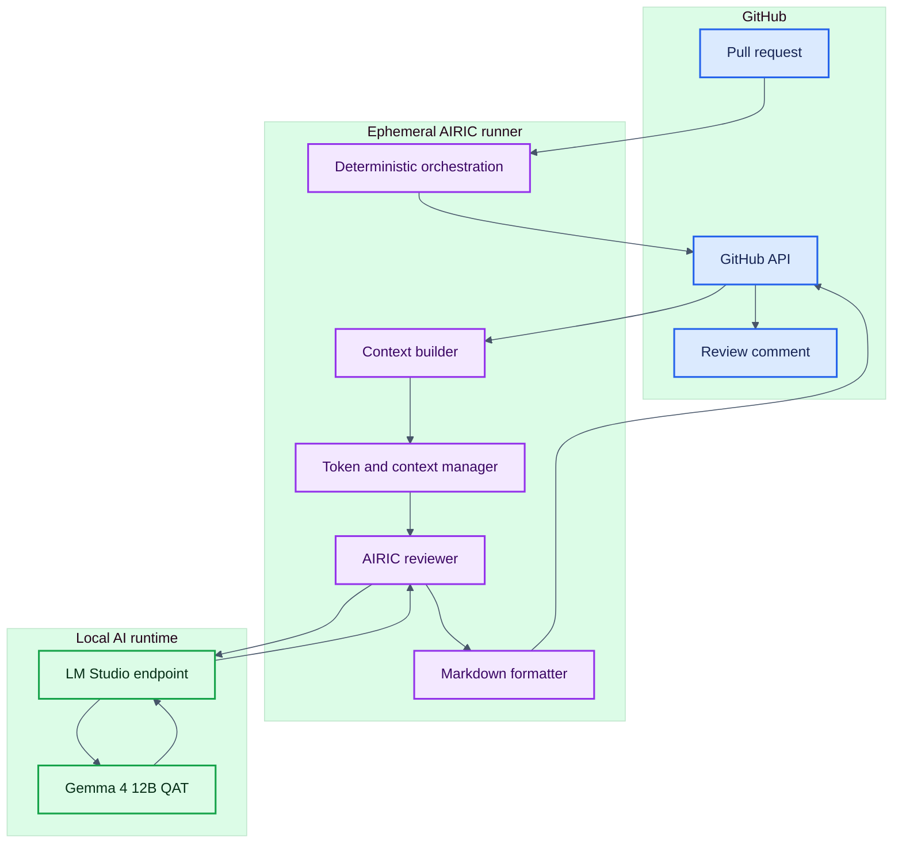
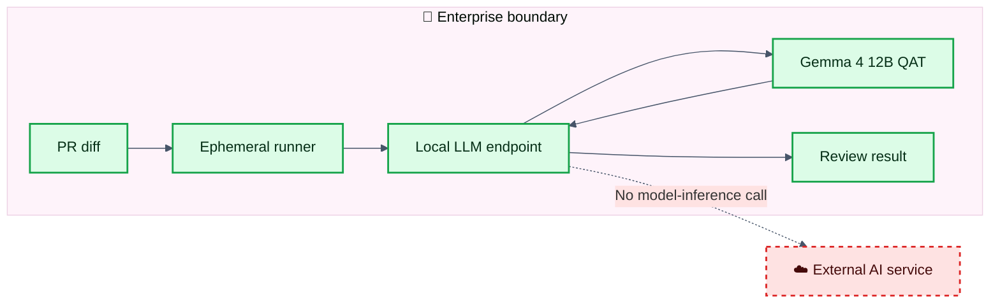
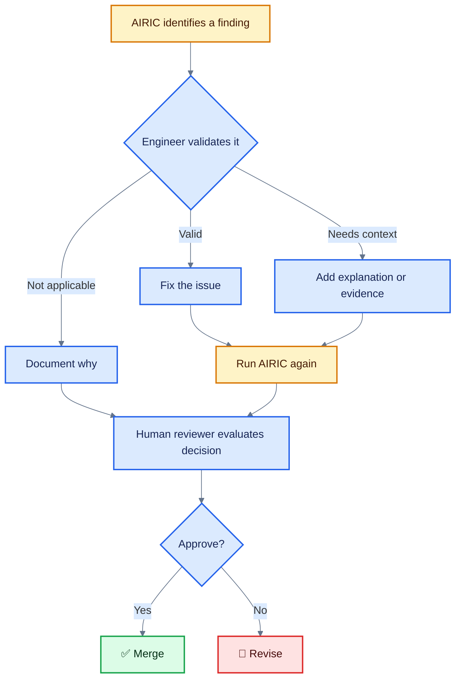
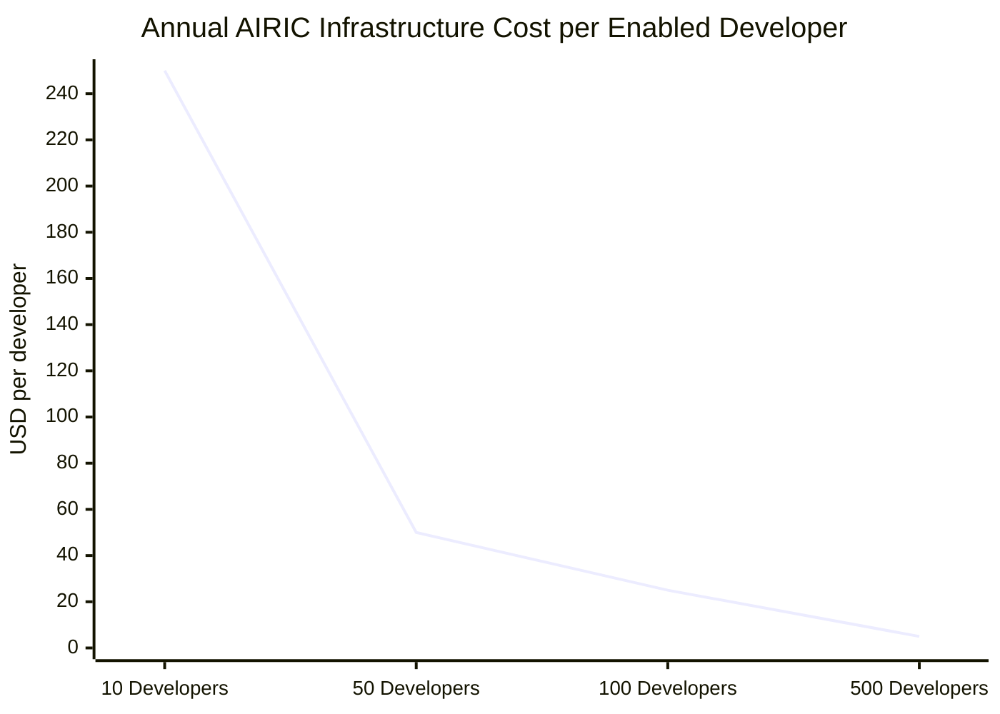
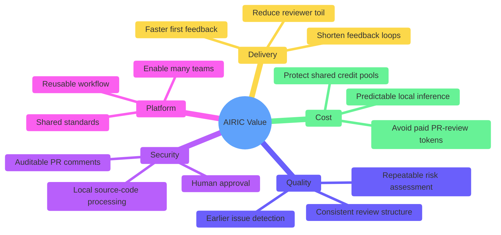
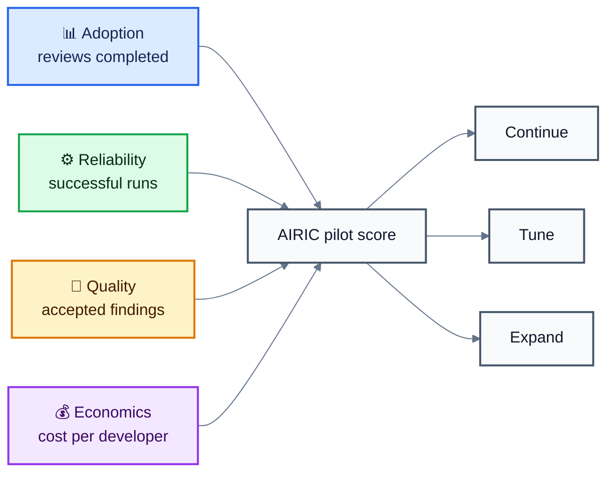

# AIRIC Case Study

> **AI Reviewer for Infrastructure and Code**  
> Local-first pull request review that improves consistency, controls per-developer token costs, and keeps engineers in control.

## Executive Summary

AIRIC adds an automated AI review to the pull request workflow.

It analyzes proposed changes, identifies potential bugs and security risks, assigns a risk level, and posts actionable feedback directly to the pull request. A human still makes the final decision.

### Why it matters

- 🔍 **Earlier feedback:** Issues surface before human review begins.
- 🛡️ **Local-first inference:** Source code is processed inside the enterprise boundary.
- 💰 **Predictable per-developer cost:** PR reviews do not consume paid cloud-model tokens.
- ⚙️ **Reusable platform capability:** Teams adopt one shared review pattern instead of building their own.
- 👤 **Human accountability:** AIRIC advises. Engineers approve.

AIRIC uses the **Gemma 4 12B QAT** large language model. The architecture uses stateless request/response processing, does not require retention of pull request content, and keeps model inference inside the enterprise boundary.

---

## The Problem

AI-generated code is increasing the volume of code teams must review. That creates several related problems:

1. More pull requests compete for limited reviewer attention.
2. Review quality varies based on reviewer availability and experience.
3. Security and quality issues may remain unnoticed until late in delivery.
4. Cloud AI reviews consume credits from a shared enterprise pool.
5. High per-developer consumption can create costs that affect the entire organization.

A recent review of AI tool usage showed that consumption exceeded the allocated monthly budget, resulting in significant overage charges. A large percentage of the monthly pool was consumed very early in the billing cycle after the new consumption model was introduced.

A per-developer monthly limit was introduced to control consumption. Higher limits have also been evaluated for high-usage scenarios.

AIRIC addresses a specific part of this problem:

> **Pull request review should not need to compete for paid cloud AI credits.**

---

## The Solution

AIRIC runs as part of the GitHub pull request workflow.

```mermaid
%%{init: {
  "theme": "base",
  "themeVariables": {
    "primaryColor": "#dbeafe",
    "primaryTextColor": "#172554",
    "primaryBorderColor": "#2563eb",
    "lineColor": "#64748b",
    "secondaryColor": "#dcfce7",
    "tertiaryColor": "#fef3c7",
    "fontFamily": "Segoe UI"
  }
}}%%
flowchart LR
    A["👩‍💻 Developer<br/>opens or updates PR"] --> B["⚙️ GitHub workflow<br/>collects diff and context"]
    B --> C["🤖 AIRIC<br/>reviews the changes"]
    C --> D["📋 Structured findings<br/>posted to the PR"]
    D --> E{"Risk level"}
    E -->|"Low"| F["✅ Rapid human review"]
    E -->|"Medium or High"| G["🛠️ Developer addresses findings"]
    G --> B
    F --> H["👤 Human approval"]
    H --> I["🚀 Merge"]

    classDef developer fill:#dbeafe,stroke:#2563eb,color:#172554,stroke-width:2px
    classDef automation fill:#ede9fe,stroke:#7c3aed,color:#2e1065,stroke-width:2px
    classDef ai fill:#fef3c7,stroke:#d97706,color:#451a03,stroke-width:2px
    classDef success fill:#dcfce7,stroke:#16a34a,color:#052e16,stroke-width:2px
    classDef action fill:#fee2e2,stroke:#dc2626,color:#450a0a,stroke-width:2px

    class A developer
    class B,D automation
    class C,E ai
    class F,H,I success
    class G action
```



The reviewer retrieves the pull request diff and changed-file context, manages the available context window, sends the prompt to the local LLM, formats the response, and posts the result to GitHub as a pull request comment.

---

## What AIRIC Reviews

AIRIC produces a structured first-pass assessment covering:

- Changed files and relevant repository context
- Potential bugs
- Security concerns
- Missing dependencies
- Code-quality issues
- Overall risk
- Suggested improvements
- A recommended review disposition

AIRIC has demonstrated the ability to identify issues such as:

- Hardcoded credentials
- SQL injection exposure
- Bare exception handlers
- Missing dependencies
- Inconsistent authentication headers
- Weak security tests
- Configuration and documentation gaps

### The important distinction

AIRIC is not simply looking for keywords.

It considers:

- What changed
- Where it changed
- The surrounding repository structure
- The apparent purpose of the file
- Whether the change affects production behavior
- Whether additional human investigation is required

---

## Architecture



### Data boundary



The model processes pull request diffs, does not retain input for future training, and is designed to keep inference inside the enterprise boundary. Communication between the runner and the model occurs through a local endpoint.

---

## Human-in-the-Loop Review

AIRIC is a reviewer, not the accountable approver.



The preferred review pattern is simple:

1. AIRIC reviews the pull request.
2. The developer validates each finding.
3. Valid findings are fixed.
4. Decisions and context are documented in the pull request.
5. AIRIC reviews the updated change.
6. A human reviewer makes the final decision.

---

## Value Proposition

### For developers

- Faster first feedback
- Less waiting for basic review findings
- Actionable comments in the existing pull request
- A consistent review format across repositories
- Fewer context switches between tools

### For reviewers

- A prepared first pass before manual review
- Earlier identification of likely hotspots
- More time for architecture, intent, and business logic
- A documented trail of findings and responses

### For security and governance

- Local source-code processing
- Stateless AI interactions
- No intended external model telemetry
- Human approval remains part of the workflow
- Consistent review output supports auditability

### For the organization

- Reduced dependence on paid cloud inference for pull request reviews
- A reusable capability that can be enabled across repositories
- More predictable per-developer AI costs
- Shared standards instead of one-off team implementations
- A foundation for future quality gates and engineering automation

---

## Per-Developer Token Cost Value Proposition

> [!IMPORTANT]
> The costs and savings below are **estimated per developer**. They are planning scenarios, not measured AIRIC savings.

### Known per-developer cost points

| Cost point | Monthly per developer | Annual per developer |
|---|---:|---:|
| Current controlled cloud-AI budget | $39 | $468 |
| Evaluated higher cloud-AI budget | $80 | $960 |
| AIRIC cloud-model token cost | $0 | $0 |

AIRIC does not eliminate every AI cost. Developers may still use GitHub Copilot or other approved tools for coding, research, or complex analysis. AIRIC specifically avoids using paid cloud-model tokens for the repeatable pull request review step.

---

## Hardware-Based Cost-to-Serve Model

> [!IMPORTANT]
> AIRIC already runs on locally owned hardware. Electricity and utility rates are intentionally excluded from this model because the local utility provider does not need an electricity chargeback for this use case.

### Current serving footprint

| Host type | AIRIC hardware basis | Role in the model |
|---|---|---|
| Local developer host | High-performance local workstation | Runs local AIRIC LLM workloads close to the developer |
| Shared lab host | Shared GPU-accelerated host | Provides shared GPU-backed inference capacity |

This changes the AIRIC cost story. AIRIC is not introducing a metered token expense. It is using hardware that is already available to the team.

### Two views of cost

| Cost view | What it includes | AIRIC implication |
|---|---|---|
| **Incremental cash cost** | New spending caused directly by an AIRIC review | **Approximately $0 per review** when existing hardware and support capacity are used |
| **Fully allocated cost** | A share of hardware depreciation and AIRIC support effort | Useful for internal planning, but not a new token or API charge |

### Cost model

```text
Annual hardware cost to serve
= annualized dedicated MacBook cost
+ annualized lab-box cost
+ additional AIRIC maintenance cost

Annual cost per enabled developer
= annual hardware cost to serve
÷ number of enabled developers

Cost per AIRIC review
= annual hardware cost to serve
÷ annual completed AIRIC reviews
```

Where:

```text
Annualized dedicated MacBook cost
= number of MacBooks dedicated to AIRIC
× acquisition cost per MacBook
÷ useful life in years

Annualized lab-box cost
= AIRIC-attributed share of lab-box acquisition cost
÷ useful life in years
```

### Treatment of the Local Workstations

The local workstations should only be charged fully to AIRIC if they were purchased specifically for AIRIC and are substantially dedicated to serving AIRIC workloads.

If AIRIC runs opportunistically on developer workstations that were already required for normal engineering work, the correct incremental hardware charge is **$0**. A utilization allocation may still be shown for planning, but it is not new AIRIC spending.

### Treatment of the Shared GPU-accelerated host

The shared GPU-accelerated host is the clearest shared serving asset. Its allocable AIRIC cost should be based on:

- The acquisition cost of the host
- Its expected useful life
- The percentage of its capacity reserved for AIRIC
- Any incremental maintenance or replacement cost caused by AIRIC

Electricity is excluded.

### Recommended baseline

| Cost component | Incremental model | Fully allocated model |
|---|---:|---:|
| Existing local workstations | $0 | AIRIC utilization share of annual depreciation |
| Existing shared GPU-accelerated host | $0 if already owned | AIRIC share of annual depreciation |
| Cloud-model tokens for AIRIC reviews | $0 | $0 |
| Electricity | $0 | $0 |
| Existing team support | $0 incremental | Optional labor allocation |
| New AIRIC-only hardware | Actual purchase cost | Annual depreciation |

### Illustrative capacity allocation

The table below shows how a **single annual AIRIC infrastructure cost** spreads across enabled developers. It does not assume a hardware purchase price. Replace the annual infrastructure amount with the actual depreciated and AIRIC-attributed hardware cost.

| Annual AIRIC infrastructure allocation | 10 developers | 50 developers | 100 developers | 500 developers |
|---:|---:|---:|---:|---:|
| $0 incremental | $0 | $0 | $0 | $0 |
| $1,000 fully allocated | $100 | $20 | $10 | $2 |
| $2,500 fully allocated | $250 | $50 | $25 | $5 |
| $5,000 fully allocated | $500 | $100 | $50 | $10 |

### Cost-to-serve graph



The graph uses a **$2,500 annual fully allocated infrastructure scenario**. It demonstrates the platform effect: the same local serving capacity becomes less expensive per developer as adoption grows.

### Comparison with per-developer cloud budgets

| Scenario | Annual cost per developer |
|---|---:|
| Current controlled cloud-AI budget | $468 |
| Evaluated higher cloud-AI budget | $960 |
| AIRIC incremental token cost | $0 |
| AIRIC incremental infrastructure cost on existing hardware | Approximately $0 |
| AIRIC fully allocated infrastructure cost | Depends on actual acquisition cost, useful life, AIRIC allocation, and enabled-developer count |

### Savings formula

```text
Annual avoided cloud cost per developer
= cloud PR-review cost displaced by AIRIC

Annual net savings per developer
= avoided cloud PR-review cost
- AIRIC fully allocated cost per developer
```

AIRIC should not claim that the full $39 or $80 monthly developer budget is saved unless telemetry proves that the full amount would otherwise have been consumed by pull request review. The defensible claim is:

> **AIRIC performs pull request reviews with no metered cloud-token charge and near-zero incremental infrastructure cost when it uses the existing MacBook Pro and Debian RTX 5060 Ti serving footprint.**

### What to measure next

To turn this model into observed unit economics, capture:

- Number of enabled developers
- Completed AIRIC reviews
- Reviews served by MacBooks versus the lab box
- Actual hardware acquisition cost
- Useful life used for internal depreciation
- Percentage of each host attributable to AIRIC
- Incremental AIRIC support hours
- Cloud PR-review credits displaced

With those values, AIRIC can report:

- Cost per enabled developer
- Cost per completed review
- Incremental cash cost
- Fully allocated cost
- Avoided cloud-token cost
- Net savings

---

## Business Value Beyond Tokens

Token savings are the easiest value to see, but they may not be the largest.



Potential value not included in the financial projection:

- Developer time saved
- Reviewer time saved
- Faster pull request turnaround
- Earlier security issue detection
- Fewer escaped defects
- Reduced rework
- More consistent engineering standards

These benefits require measured AIRIC telemetry before they should be converted into financial claims.

---

## Known Constraints

### AI output still requires validation

Gemma 4 is a stochastic language model. Findings may be incomplete or incorrect.

### Large pull requests reduce effective context

AIRIC manages context-window limits and may truncate oversized diffs. Smaller, focused pull requests provide better review context.

### Workflow reliability must be measured

Development history includes workflow failures and runs where no jobs executed. Operational telemetry and failure visibility are required before AIRIC becomes a mandatory quality gate.

### AIRIC does not replace specialized tools

AIRIC should complement, not replace:

- Human code review
- Static code analysis
- Dependency scanning
- Secret scanning
- Automated tests
- Required repository controls

---

## Success Measures

AIRIC should be evaluated with observable metrics rather than adoption counts alone.

| Measure | Why it matters |
|---|---|
| Reviews completed | Confirms workflow adoption |
| Review completion rate | Exposes execution failures |
| Median review duration | Measures feedback speed |
| Findings accepted | Indicates practical usefulness |
| Findings dismissed | Helps identify noise |
| High-risk findings confirmed | Measures security value |
| Re-review rate | Shows whether feedback drives changes |
| Human override rate | Protects human accountability |
| Cloud credits avoided per developer | Measures direct cost value |
| AIRIC operating cost per developer | Validates the cost model |
| Reviewer time saved | Measures labor value |
| Escaped defects | Measures downstream quality |

---

## Recommended Pilot Scorecard



---

## Recommended Next Step

Instrument AIRIC before making a broader financial claim.

Capture the following for every review:

```yaml
repository: example-repo
pull_request: 123
review_started_at: 2026-08-23T10:00:00Z
review_completed_at: 2026-08-23T10:01:12Z
status: completed
risk_level: medium
findings_total: 4
findings_accepted: 3
findings_dismissed: 1
re_review_requested: true
estimated_cloud_credits_avoided: 30
airic_compute_cost: null
human_review_minutes_saved: null
```

Once this telemetry exists, the projections can be replaced with observed:

- Cost per AIRIC review
- AIRIC cost per developer
- Credits avoided per developer
- Monthly and annual savings per developer
- Reviewer time saved
- Findings accepted
- Confirmed security defects
- Workflow reliability

---

## Conclusion

AIRIC moves routine AI-assisted pull request review from a variable cloud-consumption model to a reusable local platform capability.

Its value proposition is straightforward:

> **Use local AI for the repeatable first pass, reserve paid cloud AI for work that needs it, and keep the final engineering decision with a human.**

The immediate benefit is pull request review with **no metered cloud-token charge** and **near-zero incremental infrastructure cost** on the existing local serving footprint. The larger opportunity is a consistent, secure, and scalable review pattern that gives engineers faster feedback while reducing reviewer toil.
