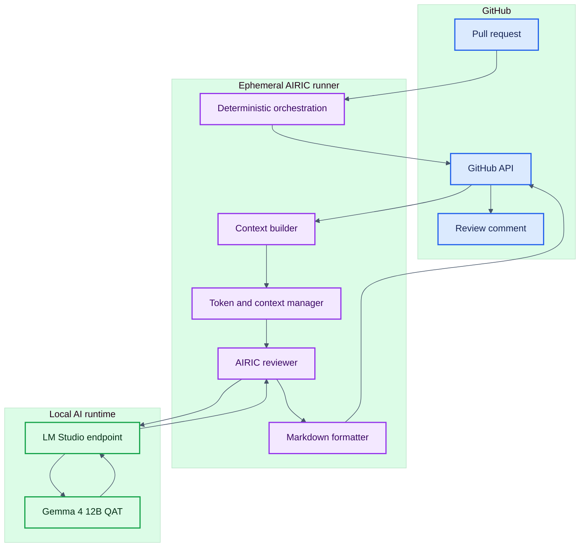
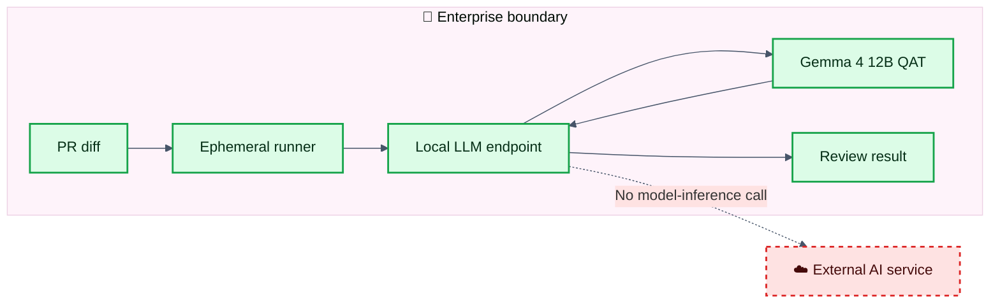
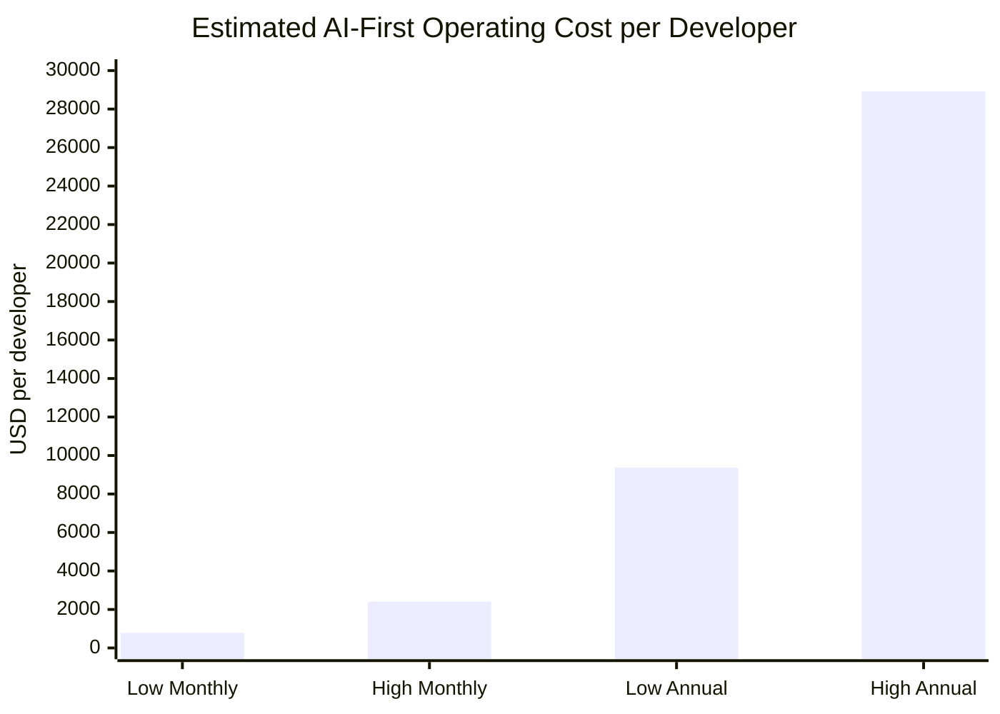
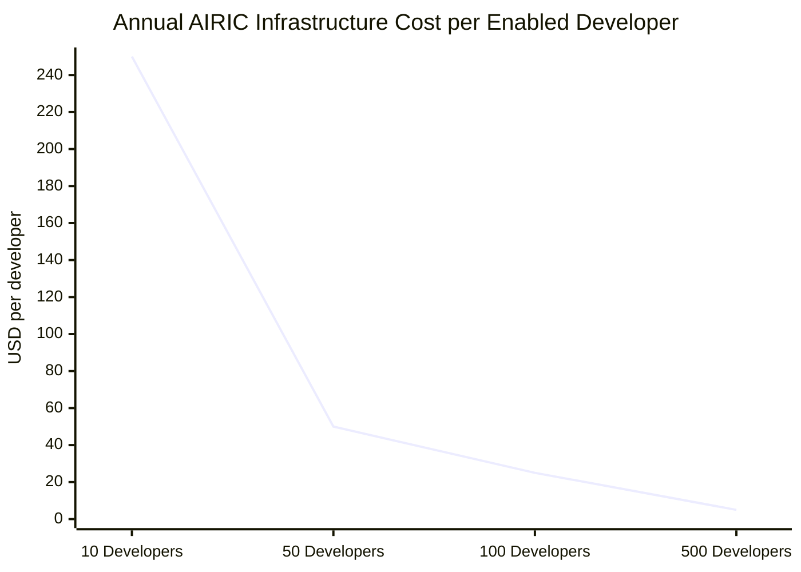
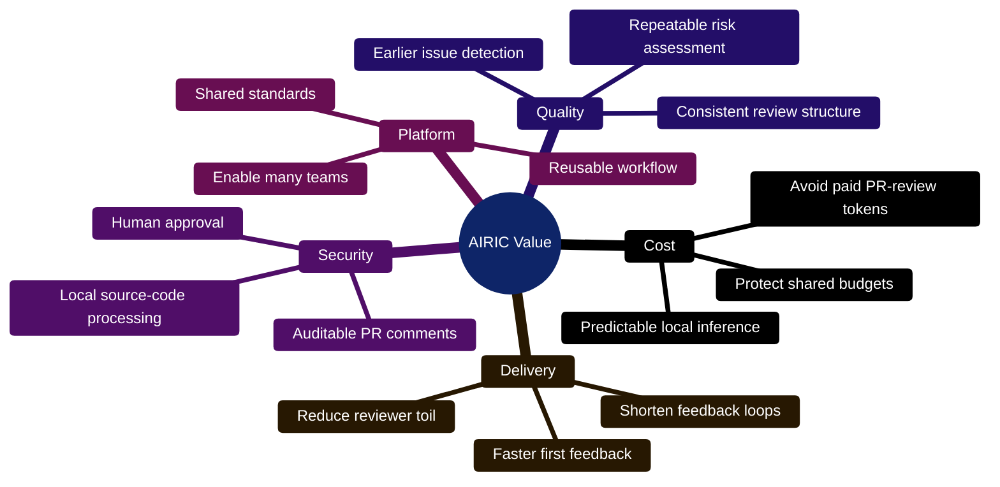

# AIRIC Case Study

> **AI Reviewer for Infrastructure and Code**  
> Local-first pull request review that improves consistency, controls per-developer token costs, and keeps engineers in control.

## Executive Summary

AIRIC adds automated AI review to the GitHub pull request workflow. It analyzes proposed changes, identifies potential bugs and security risks, assigns a risk level, and posts actionable feedback directly to the pull request. A human still makes the final decision.

### Why it matters

- 🔍 **Earlier feedback:** Issues surface before human review begins.
- 🛡️ **Local-first inference:** Source code is processed inside the enterprise boundary.
- 💰 **Predictable cost:** AIRIC pull request reviews do not consume paid cloud-model tokens.
- ⚙️ **Reusable capability:** Teams use one shared review pattern instead of building their own.
- 👤 **Human accountability:** AIRIC advises. Engineers approve.

AIRIC uses the **Gemma 4 12B QAT** large language model. Its stateless request/response architecture does not require retention of pull request content and keeps model inference inside the enterprise boundary.

---

## The Problem

AI-first engineering changes the cost and volume of software delivery. Developers may run autonomous multi-agent workflows, process large codebases through long-context windows, and use LLM-powered CI/CD pipelines for testing, review, and refactoring.

This creates several problems:

1. More pull requests compete for limited reviewer attention.
2. Review quality varies with reviewer availability and experience.
3. Security and quality issues may remain unnoticed until late in delivery.
4. Cloud AI reviews consume variable API and agentic-workflow budgets.
5. Unbounded agents can create significant per-developer cost exposure.

AIRIC addresses a specific part of this problem:

> **Pull request review should not need to compete for paid cloud AI credits.**

---

## The Solution

```mermaid
%%{init: {"theme":"base","themeVariables":{"primaryColor":"#dbeafe","primaryTextColor":"#172554","primaryBorderColor":"#2563eb","lineColor":"#64748b","secondaryColor":"#dcfce7","tertiaryColor":"#fef3c7","fontFamily":"Segoe UI"}}}%%
flowchart LR
    A["👩‍💻 Developer<br/>opens or updates PR"] --> B["⚙️ GitHub workflow<br/>collects diff and context"]
    B --> C["🤖 AIRIC<br/>reviews the changes"]
    C --> D["📋 Structured findings<br/>posted to the PR"]
    D --> E{"Risk level"}
    E -->|Low| F["✅ Rapid human review"]
    E -->|Medium or High| G["🛠️ Developer addresses findings"]
    G --> B
    F --> H["👤 Human approval"]
    H --> I["🚀 Merge"]

    classDef developer fill:#dbeafe,stroke:#2563eb,color:#172554,stroke-width:2px
    classDef automation fill:#ede9fe,stroke:#7c3aed,color:#2e1065,stroke-width:2px
    classDef ai fill:#fef3c7,stroke:#d97706,color:#451a03,stroke-width:2px
    classDef success fill:#dcfce7,stroke:#16a34a,color:#052e16,stroke-width:2px
    classDef action fill:#fee2e2,stroke:#dc2626,color:#450a0a,stroke-width:2px

    class A developer
    class B,D automation
    class C,E ai
    class F,H,I success
    class G action
```



The reviewer retrieves the pull request diff and changed-file context, manages the available context window, sends the prompt to the local LLM, formats the response, and posts the result to GitHub.

## What AIRIC Reviews

- Changed files and repository context
- Potential bugs
- Security concerns
- Missing dependencies
- Code-quality issues
- Overall risk
- Suggested improvements
- Recommended review disposition

AIRIC has demonstrated the ability to identify hardcoded credentials, SQL injection exposure, bare exception handlers, missing dependencies, inconsistent authentication headers, weak security tests, and configuration or documentation gaps.

---

## Architecture



### Data Boundary



---

## Human-in-the-Loop Review

AIRIC is a reviewer, not the accountable approver.

1. AIRIC reviews the pull request.
2. The developer validates each finding.
3. Valid findings are fixed.
4. Decisions and context are documented.
5. AIRIC reviews the updated change.
6. A human reviewer makes the final decision.

---

## Value Proposition

### For Developers

- Faster first feedback
- Actionable comments in the pull request
- Consistent review format
- Fewer context switches

### For Reviewers

- A prepared first pass
- Earlier identification of likely hotspots
- More time for architecture, intent, and business logic
- A documented trail of findings and responses

### For Security and Governance

- Local source-code processing
- Stateless AI interactions
- No intended external model telemetry
- Human approval remains part of the workflow
- Consistent output supports auditability

### For the Organization

- Reduced dependence on paid cloud inference for pull request reviews
- Reusable capability across repositories
- More predictable per-developer AI costs
- Shared standards instead of one-off implementations
- Foundation for future quality gates and engineering automation

---

## AI-First Developer Cost Baseline

> [!IMPORTANT]
> A fully unconstrained AI-first software engineer requires an estimated monthly operating budget of **$780 to $2,410 per developer**, or **$9,360 to $28,920 annualized**.
>
> These figures are planning estimates for a broader AI-first engineering model, not measured AIRIC spending.

### 📊 Comprehensive Cost Breakdown

| Expense category | Low estimate per developer/month | High estimate per developer/month | Rationale |
|---|---:|---:|---|
| Fixed subscriptions | $30 | $60 | Baseline interactive IDE and chat utilities such as Cursor Pro, GitHub Copilot, and ChatGPT Enterprise. |
| Low-intensity API traffic | $50 | $150 | Quick debugging, syntax checks, and ad hoc questions using custom API keys. |
| High-intensity agentic API | $150 | $400 | Large token consumption from autonomous coding agents and repository-scale context. |
| CI/CD multi-agent automation | $500 | $1,500 | Multi-step agent loops triggered by commits for testing, review, and refactoring. |
| Specialized models and fine-tuning | $50 | $300 | Domain-specific customization, fine-tuning, or multimodal workloads. |
| **Total per developer** | **$780** | **$2,410** | **Annualized: $9,360 to $28,920** |



### 💡 Core Budget Realities and Hidden Costs

- ⚠️ **Long-context tax:** In the supplied planning scenario, a 200,000-token context can cost approximately **$0.60 to $1.00 per interaction**. At 50 interactions per day, that becomes approximately **$15 to $30 daily**.
- 📈 **Runaway agent loops:** Autonomous agents can enter long multi-turn loops. Hard spending limits, timeouts, iteration limits, and approval gates are required.
- 🛠️ **Infrastructure optimization:** Internally hosted open-weights models can handle syntax checks, first-pass review, and test scaffolding. Frontier models can be reserved for deeper synthesis.

---

## Hardware-Based Cost-to-Serve Model

### Current Serving Footprint

| Host type | AIRIC hardware basis | Role in the model |
|---|---|---|
| Local developer host | MacBook Pro M5 with 48 GB unified memory | Runs local AIRIC LLM workloads close to the developer. |
| Shared lab host | Headless Debian Linux system with 16 CPUs, 20 GB RAM, and one NVIDIA RTX 5060 Ti with 16 GB VRAM | Provides shared GPU-backed inference capacity. |

AIRIC uses hardware already available to the team and avoids managed AI platform and inference charges for pull request reviews, such as usage through AWS Bedrock.

### Two Views of Cost

| Cost view | What it includes | AIRIC implication |
|---|---|---|
| **Incremental cash cost** | New spending caused directly by an AIRIC review | **Approximately $0 per review** when existing hardware and team capacity are used. |
| **Fully allocated cost** | A share of hardware depreciation and AIRIC support effort | Useful for internal planning, but not a managed AI platform, hosted inference, or API charge. |

### Cost Model

```text
Annual hardware cost to serve
= annualized dedicated MacBook cost
+ annualized lab-box cost
+ additional AIRIC maintenance cost

Annual cost per enabled developer
= annual hardware cost to serve
÷ number of enabled developers

Cost per AIRIC review
= annual hardware cost to serve
÷ annual completed AIRIC reviews
```

### Hardware Treatment

MacBooks should only be charged fully to AIRIC if they were purchased specifically for AIRIC and are substantially dedicated to AIRIC workloads. If AIRIC runs on developer MacBooks already required for engineering work, the incremental hardware charge is **$0**.

The shared Debian RTX 5060 Ti host should be allocated based on acquisition cost, expected useful life, percentage of capacity reserved for AIRIC, and incremental maintenance or replacement cost caused by AIRIC.

### Recommended Baseline

| Cost component | Incremental model | Fully allocated model |
|---|---:|---:|
| Existing MacBook Pro M5 hosts | $0 | AIRIC utilization share of annual depreciation |
| Existing Debian RTX 5060 Ti lab box | $0 if already owned | AIRIC share of annual depreciation |
| Managed AI platform services for AIRIC reviews, such as AWS Bedrock | $0 | $0 |
| Existing team support | $0 incremental | Optional labor allocation |
| New AIRIC-only hardware | Actual purchase cost | Annual depreciation |

### Illustrative Capacity Allocation

| Annual AIRIC infrastructure allocation | 10 developers | 50 developers | 100 developers | 500 developers |
|---:|---:|---:|---:|---:|
| $0 incremental | $0 | $0 | $0 | $0 |
| $1,000 fully allocated | $100 | $20 | $10 | $2 |
| $2,500 fully allocated | $250 | $50 | $25 | $5 |
| $5,000 fully allocated | $500 | $100 | $50 | $10 |



The graph uses a **$2,500 annual fully allocated infrastructure scenario** and demonstrates the platform effect: the same local serving capacity becomes less expensive per developer as adoption grows.

### AIRIC Compared with the AI-First Cost Baseline

| Scenario | Monthly cost per developer | Annual cost per developer |
|---|---:|---:|
| AI-first operating budget, low estimate | $780 | $9,360 |
| AI-first operating budget, high estimate | $2,410 | $28,920 |
| Managed AI platform and inference cost for AIRIC PR review, such as AWS Bedrock | $0 | $0 |
| AIRIC incremental infrastructure cost on existing hardware | Approximately $0 | Approximately $0 |
| AIRIC fully allocated infrastructure cost | Depends on acquisition cost, useful life, AIRIC allocation, support effort, and enabled-developer count | Same basis annualized |

### Avoided-Cost Formula

```text
Annual managed AI platform cost displaced by AIRIC per developer
= managed AI platform and hosted-inference usage avoided by local AIRIC reviews

Annual net value per developer
= cloud PR-review cost displaced
- AIRIC fully allocated cost per developer
```

The full **$780 to $2,410 monthly AI-first operating budget** should not be presented as AIRIC savings. AIRIC addresses one workload within that budget: automated pull request review. Savings must be based on the managed AI platform, hosted inference, agentic workflow, or CI/CD review consumption that AIRIC actually displaces.

> **Defensible value statement:** AIRIC performs automated pull request reviews with no managed AI platform or hosted-inference charge and near-zero incremental infrastructure cost when it uses the existing MacBook Pro M5 and Debian RTX 5060 Ti serving footprint.

---

## Business Value Beyond Tokens



Potential value not included in the financial projection includes developer time saved, reviewer time saved, faster pull request turnaround, earlier security issue detection, fewer escaped defects, reduced rework, and more consistent engineering standards.

---

## Known Constraints

- **AI output requires validation:** Gemma 4 is stochastic, so findings may be incomplete or incorrect.
- **Large pull requests reduce context:** Oversized diffs may be truncated. Smaller pull requests provide better review context.
- **Workflow reliability must be measured:** Operational telemetry is required before AIRIC becomes a mandatory quality gate.
- **AIRIC complements specialized tools:** It does not replace human review, static analysis, dependency scanning, secret scanning, automated tests, or repository controls.

---

## Success Measures

| Measure | Why it matters |
|---|---|
| Reviews completed | Confirms adoption |
| Review completion rate | Exposes execution failures |
| Median review duration | Measures feedback speed |
| Findings accepted or dismissed | Measures usefulness and noise |
| High-risk findings confirmed | Measures security value |
| Human override rate | Protects human accountability |
| Cloud costs displaced per developer | Measures direct cost value |
| AIRIC operating cost per developer | Validates the cost model |
| Reviewer time saved | Measures labor value |
| Escaped defects | Measures downstream quality |

---

## Recommended Next Step

Capture the following for every review:

```yaml
repository: example-repo
pull_request: 123
review_started_at: 2026-08-23T10:00:00Z
review_completed_at: 2026-08-23T10:01:12Z
status: completed
risk_level: medium
findings_total: 4
findings_accepted: 3
findings_dismissed: 1
re_review_requested: true
estimated_managed_ai_cost_displaced: null
airic_compute_cost: null
human_review_minutes_saved: null
serving_host: macbook-or-lab
```

This enables AIRIC to report cost per review, cost per enabled developer, incremental cash cost, fully allocated cost, managed AI platform cost displaced, reviewer time saved, and net value.

---

## Conclusion

AIRIC moves routine AI-assisted pull request review from variable cloud consumption to a reusable local platform capability.

> **Use local AI for the repeatable first pass, reserve paid cloud AI for work that needs it, and keep the final engineering decision with a human.**

The immediate benefit is automated pull request review with **no managed AI platform or hosted-inference charge** and **near-zero incremental infrastructure cost** on the existing local serving footprint. This helps offset one recurring workload inside an estimated **$780 to $2,410 monthly AI-first operating budget per developer**.
