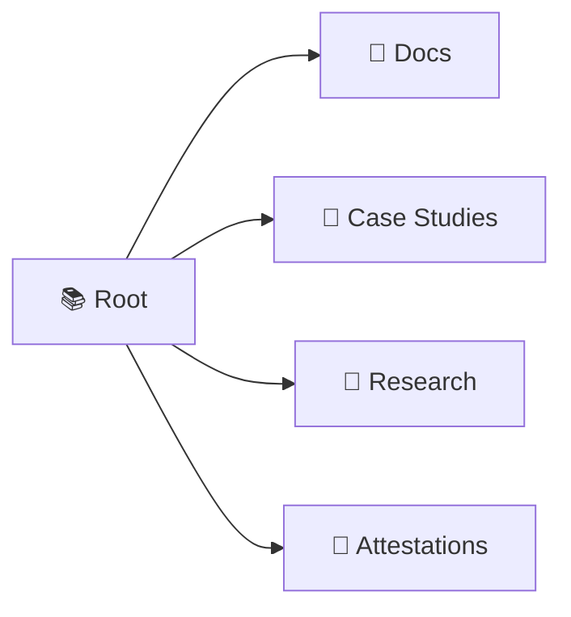

# 📚 Repository Overview

Welcome to my central hub for documentation, research, and professional attestations. This repository is designed with a **low-cognitive-load layout** to make navigation intuitive and fast.

## 🗺️ Repository Map

## 📂 Directory Breakdown

| Directory | Purpose | Description |
| :--- | :--- | :--- |
| 📄 **`docs/`** | 📖 **Knowledge Base** | General documentation, guides, and standard operating procedures. |
| 📝 **`case-studies/`** | 💼 **Portfolio** | Detailed narratives of projects, challenges, and successful outcomes. |
| 🔬 **`research/`** | 🧪 **Exploration** | Experimental notes, academic papers, and deep-dive explorations. |
| 📜 **`attestations/`** | ✅ **Validation** | Formal records, certificates, and verified credentials. |

## 🚀 Quick Navigation
- **Want to learn how?** Head to `docs/`.
- **Want to see what I've built?** Check `case-studies/`.
- **Want to see my deep dives?** Explore `research/`.
- **Need to verify my credentials?** View `attestations/`.

---
*Designed for clarity and ease of use.*

